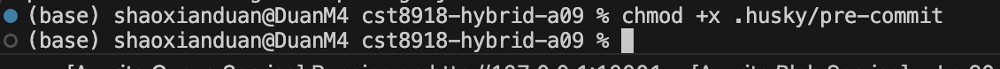
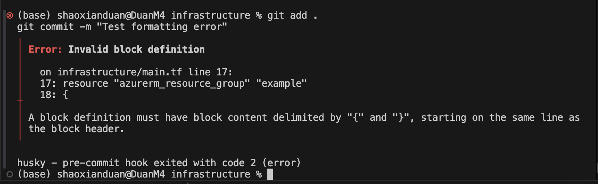

# Hybrid-A09: Husky & GitHub Actions for Terraform CI/CD

## Course: CST8918 - DevOps: Infrastructure as Code  
**Professor:** Robert McKenney

---

## 📜 Project Overview

This project demonstrates a basic CI/CD pipeline for an Infrastructure as Code (IaC) project using **Terraform**, **Husky**, and **GitHub Actions**. The pipeline automates:

- **Code quality checks** with Husky pre-commit hooks
- **Terraform format validation** on pull requests
- **Terraform configuration validation** in GitHub Actions

The project deploys a basic **Azure resource** (e.g., Storage Account or AKS Cluster) via Terraform, providing an automated and repeatable way to manage cloud infrastructure.

---

## 📂 Project Structure

```
.
├── infrastructure/         # Terraform scripts
├── .github/workflows/      # GitHub Actions workflows
│   └── action-terraform-verify.yml
├── .husky/                  # Husky pre-commit hooks
├── package.json
└── README.md
```

---

## ⚙️ Setting Up Husky Pre-Commit Hooks

### 1. Initialize Node project
```bash
npm init -y
```

### 2. Install Husky
```bash
npm install husky --save-dev
```


### 3. Initialize Husky
```bash
npx husky-init
```


### 4. Configure Pre-Commit Hook
Update `.husky/pre-commit`:
```bash
echo "terraform fmt -check -recursive" > .husky/pre-commit
echo "terraform validate" >> .husky/pre-commit
echo "tflint" >> .husky/pre-commit
chmod +x .husky/pre-commit
```


### 5. Test Pre-Commit Hook
- Intentionally break your Terraform formatting or syntax.


- Try committing — the hook should block the commit.

- Fix the errors, commit again — it should succeed.


---

## 🔄 GitHub Actions Workflow

### File: `.github/workflows/action-terraform-verify.yml`


This workflow runs on pull requests to the `main` or `master` branches and performs:
- `terraform fmt -check` on changed `.tf` files
- **Terraform validation**

### Example Workflow (Partial):

```yaml
name: Validate terraform fmt
on:
  pull_request:
    branches:
      - main
      - master

jobs:
  validate:
    runs-on: ubuntu-latest
    name: terraform fmt check
    steps:
      - uses: actions/checkout@v3
      - name: Configure terraform
        uses: hashicorp/setup-terraform@v2
        with:
          terraform_version: 1.2.4
      - name: Validate terraform fmt
        run: terraform fmt -check -recursive

  terraform-validate:
    runs-on: ubuntu-latest
    name: terraform validate
    steps:
      - uses: actions/checkout@v3
      - name: Configure terraform
        uses: hashicorp/setup-terraform@v2
        with:
          terraform_version: 1.2.4
      - name: Initialize terraform
        run: terraform init
      - name: Validate terraform configuration
        run: terraform validate
```

---

## ✅ Testing the Workflow

1. Add a Terraform syntax or formatting error.

2. Bypass the pre-commit hook:
   ```bash
   git commit -m "test commit" --no-verify
   ```

   
3. Push the branch and create a Pull Request.
4. ✅ **Expected:** GitHub Actions fails on the broken Terraform code.
5. Fix the errors and push again.
6. ✅ **Expected:** GitHub Actions passes.

---

## 🚀 Terraform Script Example

Example: Create a Storage Account in Azure (`infrastructure/main.tf`).

```hcl
provider "azurerm" {
  features {}
}

resource "azurerm_resource_group" "example" {
  name     = "rg-example"
  location = "East US"
}

resource "azurerm_storage_account" "example" {
  name                     = "examplestoracc"
  resource_group_name      = azurerm_resource_group.example.name
  location                 = azurerm_resource_group.example.location
  account_tier             = "Standard"
  account_replication_type = "LRS"
}
```

---

## Author
# Student Name: Shaoxian Duan
